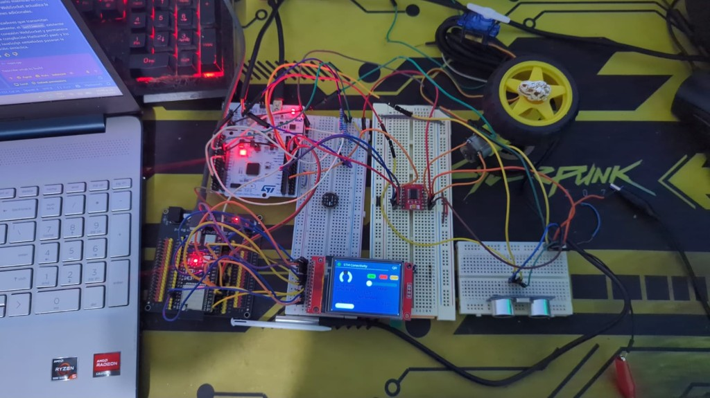
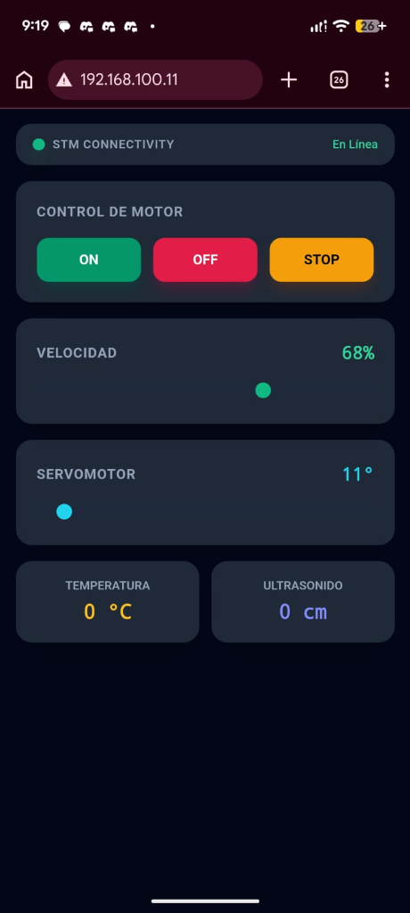
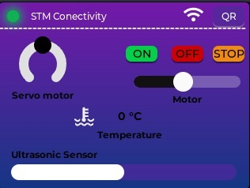
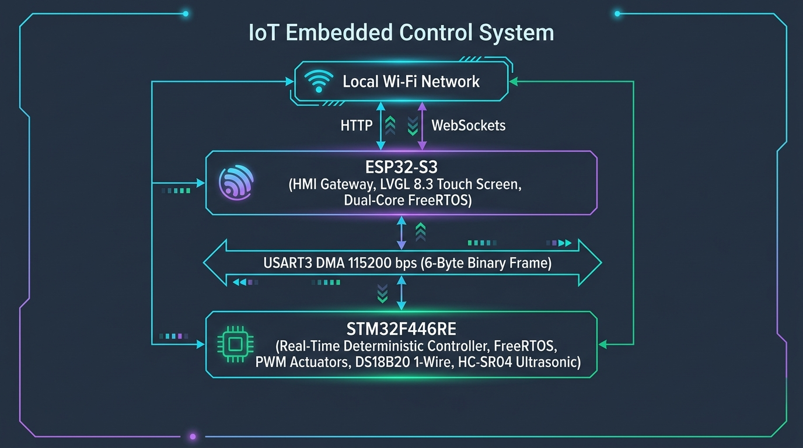
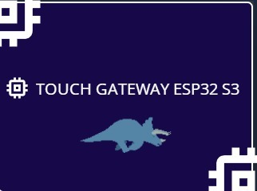

<div align="center">

<p align="center">
  <a href="https://www.st.com/" target="_blank">
    
  </a>
  &nbsp;&nbsp;&nbsp;&nbsp;&nbsp;&nbsp;&nbsp;&nbsp;&nbsp;&nbsp;&nbsp;&nbsp;&nbsp;&nbsp;&nbsp;&nbsp;
  <a href="https://www.espressif.com/" target="_blank">
    
  </a>
</p>

# Estación de Control HMI y Telemetría IoT Bidireccional
### *STM32F446RE + ESP32-S3 | FreeRTOS | USART DMA | LVGL 8.3 | WebSockets*

[](https://www.st.com/)
[](https://www.espressif.com/)
[](https://www.freertos.org/)
[](https://lvgl.io/)
[](https://tailwindcss.com/)
[-6B21A8?style=flat)]()
[](https://github.com/DanyGhostt/Estacion-de-Control-y-Telemetr-a-IoT.git)

</div>

---

## 📸 Galería del Proyecto / Project Showcase

### 🔬 1. Ensamble Físico Completo / Full Physical Setup
<p align="center">
  
  <br>
  <em>Banco de pruebas integrado: STM32 Nucleo-F446RE, ESP32-S3 DevKit, Display TFT ILI9341, Driver TB6612FNG, Motorreductor DC, Servomotor SG90 y Sensores.</em>
</p>

---

### 📱 2. Aplicación Web Responsive (Control Local IoT) / Web Dashboard
<p align="center">
  
  <br>
  <em>Dashboard web servido en red local con controles de motor (ON/OFF/STOP), sliders de velocidad/servo y visor de telemetría en tiempo real.</em>
</p>

---

### 🖥️ 3. Dashboard HMI Táctil Principal / Main HMI Touch Dashboard
<p align="center">
  
  <br>
  <em>Interfaz táctil interactiva LVGL 8.3 ejecutada a 60 FPS sobre display TFT ILI9341 con digitalizador XPT2046.</em>
</p>

---

# Español

## 📌 1. Descripción General y Arquitectura

Sistema distribuido de control de actuadores y telemetría en tiempo real compuesto por un nodo de control determinista (**STM32F446RE**) y un nodo de visualización / pasarela web (**ESP32-S3**).

<p align="center">
  
</p>

```
                  +-------------------------------------------------------------+
                  |                     RED WI-FI LOCAL                         |
                  |     (Smartphone / PC en la misma subred WLAN)               |
                  +------------------------------+------------------------------+
                                                 | HTTP (Port 80) / WebSocket
                                                 v
+-------------------------------------------------------------------------------+
| ESP32-S3 (HMI & Gateway IoT)                                                 |
|  - Core 1 (vGuiTask): Renderizado gráfico LVGL 8.3 (TFT ILI9341 + XPT2046 Touch) |
|  - Core 0 (vControlTask): Gestión de colas de comando y sondeo bidireccional   |
|  - Core 0 (vWiFiTask): Servidor Web Asíncrono + Endpoint WebSocket `/ws`      |
+---------------------------------------+---------------------------------------+
                                        | Enlace USART3 (115200 bps)
                                        | Tramas binarias de 6 bytes
                                        v
+-------------------------------------------------------------------------------+
| STM32F446RE (Controlador Determinista de Tiempo Real)                         |
|  - DMA1 Stream 1 / Stream 3: Recepción y Transmisión no bloqueante            |
|  - FreeRTOS vSensorTask: Muestreo Ultrasonido (TIM1 IC) y DS18B20 (1-Wire)    |
|  - FreeRTOS vMotorTask: Servomotor (TIM3 PWM 50Hz) y Motor DC (TIM4 PWM 10kHz)|
|  - EXTI13: Paro de Emergencia por Hardware con corte instantáneo de energía   |
+-------------------------------------------------------------------------------+
```

---

## 🛠️ 2. Mapeo de Tecnologías y Dónde se Incorporaron

### ⚙️ A. FreeRTOS en STM32F446RE (CMSIS-OS v2)
* **Archivos**: [`STM_TO_ESP32_UART/Core/Src/main.c`](file:///c:/Users/juand/OneDrive/Desktop/Stm32%20to%20esp32/STM_TO_ESP32_UART/Core/Src/main.c), [`STM_TO_ESP32_UART/Core/Inc/FreeRTOSConfig.h`](file:///c:/Users/juand/OneDrive/Desktop/Stm32%20to%20esp32/STM_TO_ESP32_UART/Core/Inc/FreeRTOSConfig.h)
* **Hilos de Ejecución (Tasks)**:
  1. `vSensorTask` (`StartSensorTask`, líneas 750–776): Adquisición periódica no bloqueante de ultrasonido cada $60\text{ ms}$ (`osDelay(60)`) y máquina de estados térmica para el sensor DS18B20 cada $840\text{ ms}$.
  2. `vMotorTask` (`StartMotorTask`, líneas 785–885): Hilo consumidor que espera en `osMessageQueueGet(QueueCommandHandle, ..., osWaitForever)` para aplicar velocidad PWM y responder telemetría por DMA.
* **Colas (Queues)**:
  - `QueueCommandHandle` (`osMessageQueueNew(4, sizeof(RemoteInteractionFrame_t))`, línea 197): Desacopla las interrupciones de hardware (DMA RX y botón de emergencia) de la lógica de actuación.
* **Secciones Críticas**:
  - Blindaje del bus 1-Wire con `__disable_irq()` y `__set_PRIMASK()` (líneas 649–702) para evitar jitter por preempción del RTOS durante la lectura del DS18B20.

---

### ⚙️ B. FreeRTOS Dual-Core en ESP32-S3 (ESP-IDF / Arduino)
* **Archivo**: [`Receptor_1_ARduino/src/main.cpp`](file:///c:/Users/juand/OneDrive/Desktop/Stm32%20to%20esp32/Receptor_1_ARduino/src/main.cpp)
* **Afinidad de Núcleos (Task Core Pinning)**:
  1. `vGuiTask` (**Core 1**, Stack 8192 B, Prioridad 3, líneas 711–781): Renderizado gráfico exclusivo de LVGL 8.3 a 66 FPS (`vTaskDelayUntil` a 15 ms), animación con máscara del Triceratops y digitalización táctil XPT2046.
  2. `vControlTask` (**Core 0**, Stack 4096 B, Prioridad 4, líneas 786–836): Gestión del enlace serie con STM32, despacho de cola de comandos, sondeo periódico (200 ms) y difusión WebSocket (500 ms).
  3. `vWiFiTask` (**Core 0**, Stack 4096 B, Prioridad 2, líneas 232–258): Reconexión Wi-Fi Station y actualización dinámica de la IP en la pantalla QR.
* **Mecanismos de Sincronización**:
  - `xGuiMutex` (`SemaphoreHandle_t`, línea 88): Mutex que protege el árbol de objetos de LVGL de accesos concurrentes desde WebSockets o hilos de red.
  - `xCommandDispatchQueue` (`QueueHandle_t`, línea 87): Cola FIFO para unificar acciones de control generadas en la pantalla táctil y en la interfaz web.

---

### ⚡ C. Acceso Directo a Memoria: DMA USART3 (STM32)
* **Archivo**: [`STM_TO_ESP32_UART/Core/Src/main.c`](file:///c:/Users/juand/OneDrive/Desktop/Stm32%20to%20esp32/STM_TO_ESP32_UART/Core/Src/main.c#L576-L626)
* **`DMA1_Stream1` (RX)**: Recepción continua de tramas de 6 bytes en `esp32_frame_rx`. Al completar la recepción dispara `DMA1_Stream1_IRQHandler`, valida el checksum y encola el comando sin intervención del CPU.
* **`DMA1_Stream3` (TX)**: Transmisión asíncrona de telemetría hacia el ESP32 mediante recarga directa de registros (`DMA1_Stream3->NDTR = 6; DMA1_Stream3->CR |= DMA_SxCR_EN;`).

---

### ⏱️ D. Periféricos Temporizadores por Registros CMSIS (STM32)
* **Archivo**: [`STM_TO_ESP32_UART/Core/Src/main.c`](file:///c:/Users/juand/OneDrive/Desktop/Stm32%20to%20esp32/STM_TO_ESP32_UART/Core/Src/main.c#L335-L414)
* **`TIM3_CH1` (PA6, AF2)**: Generador PWM a $50\text{ Hz}$ (Periodo $20\text{ ms}$, $ARR=19999, PSC=83$) para control del servomotor SG90 (pulsos de $1000\ \mu\text{s}$ a $2000\ \mu\text{s}$).
* **`TIM4_CH1` (PB6, AF2)**: Generador PWM a $10\text{ kHz}$ ($ARR=99, PSC=83$) para control de velocidad analógico del motor DC mediante driver TB6612FNG.
* **`TIM1_CH1` (PA8, AF1)**: Temporizador a $1\text{ MHz}$ ($PSC=83$) configurado como *Input Capture* en pin tolerante a 5V para medir el pulso Echo del HC-SR04 con resolución de $1\ \mu\text{s}$.
* **`EXTI13` (PC13)**: Interrupción de hardware externa en el botón azul B1 para Paro de Emergencia inmediato.

---

### 🌡️ E. Protocolo 1-Wire por Software para DS18B20 (STM32)
* **Archivo**: [`STM_TO_ESP32_UART/Core/Src/main.c`](file:///c:/Users/juand/OneDrive/Desktop/Stm32%20to%20esp32/STM_TO_ESP32_UART/Core/Src/main.c#L627-L740)
* Comunicación a nivel de microsegundos sobre el pin `PB0` mediante retardos calibrados por ensamblador inline (`DS18B20_Delay_us`) con conmutación dinámica de modo (`Salida Push-Pull` $\leftrightarrow$ `Entrada Flotante`).

---

### 🎨 F. Motor Gráfico LVGL 8.3.11 & Controladores Táctiles (ESP32)
* **Archivos**: [`Receptor_1_ARduino/src/main.cpp`](file:///c:/Users/juand/OneDrive/Desktop/Stm32%20to%20esp32/Receptor_1_ARduino/src/main.cpp), [`Receptor_1_ARduino/include/lv_conf.h`](file:///c:/Users/juand/OneDrive/Desktop/Stm32%20to%20esp32/Receptor_1_ARduino/include/lv_conf.h)
* Búfer de dibujo en SRAM interna (`lv_disp_draw_buf_init`) con driver de refresco `my_disp_flush` sobre bus SPI Adafruit ILI9341 a 16 MHz.
* Driver táctil `my_touchpad_read` con mapeo de coordenadas XPT2046 y filtrado de presión ($Z$).
* Módulo `lv_gif` para renderizado del Triceratops y `lv_qrcode` para generación vectorial en tiempo real del código QR de conexión.

---

### 🌐 G. Pila IoT Web Asíncrona & WebSockets (ESP32)
* **Archivos**: [`Receptor_1_ARduino/src/main.cpp`](file:///c:/Users/juand/OneDrive/Desktop/Stm32%20to%20esp32/Receptor_1_ARduino/src/main.cpp), [`Receptor_1_ARduino/include/web_ui.h`](file:///c:/Users/juand/OneDrive/Desktop/Stm32%20to%20esp32/Receptor_1_ARduino/include/web_ui.h)
* **`ESPAsyncWebServer` + `AsyncWebSocket` (`/ws`)**: Servidor HTTP y socket bidireccional no bloqueante.
* **`ArduinoJson v7`**: Serialización de telemetría y deserialización de comandos web.
* **Frontend SPA embebido en Flash (`PROGMEM`)**: Estilizado con **Tailwind CSS**, soporte para modo oscuro y reactividad sin recarga de página.

---

## 🗂️ 3. Estructura del Repositorio

```
Estacion-de-Control-y-Telemetr-a-IoT/
│
├── Receptor_1_ARduino/                # Firmware del ESP32-S3 (PlatformIO)
│   ├── assets/                        # Recursos gráficos (GIFs y fuentes)
│   │   ├── triceratops.gif            # Animación original del dinosaurio
│   │   └── triceratops_215x110.gif    # Versión escalada para el Splash Screen
│   ├── include/
│   │   ├── lv_conf.h                  # Configuración del motor LVGL 8.3
│   │   └── web_ui.h                   # Interfaz Web SPA (HTML5/Tailwind/JS)
│   ├── src/
│   │   ├── main.cpp                   # Lógica multi-tarea FreeRTOS, LVGL y WebSockets
│   │   ├── triceratops_gif.h          # Encabezado del buffer de imagen C
│   │   └── triceratops_gif_data.cpp   # Array binario en memoria Flash del GIF
│   └── platformio.ini                 # Configuración de compilación y librerías
│
├── STM_TO_ESP32_UART/                 # Firmware del STM32F446RE (STM32CubeIDE)
│   ├── Core/
│   │   ├── Inc/
│   │   │   ├── FreeRTOSConfig.h       # Configuración del kernel FreeRTOS
│   │   │   ├── main.h                 # Mapeo de pines y definiciones globales
│   │   │   └── stm32f4xx_it.h         # Prototipos de interrupciones
│   │   └── Src/
│   │       ├── main.c                 # Control de actuadores, DMA, 1-Wire y RTOS
│   │       ├── freertos.c             # Definición de hilos y colas CMSIS-OS
│   │       └── stm32f4xx_it.c         # Manejadores de interrupciones NVIC
│   └── STM_TO_ESP32_UART.ioc          # Proyecto gráfico STM32CubeMX
│
├── docs/                              # Recursos de documentación
│   └── images/                        # Fotos del circuito, app web y pantallas LVGL
│
└── README.md                          # Documentación maestra del sistema
```

---

## ⚡ 4. Protocolo Binario de Comunicación (USART + DMA)

La comunicación entre el ESP32-S3 y la STM32F446RE se realiza a **115200 baudios (8N1)** mediante una trama estructurada de **6 bytes de longitud fija**:

### Formato de la Trama (`RemoteInteractionFrame_t`)

| Byte | Campo | Tipo | Valor / Rango | Descripción |
| :---: | :--- | :---: | :---: | :--- |
| **0** | `startMarker` | `uint8_t` | `0xAA` | Byte de sincronización de inicio de trama |
| **1** | `commandCode` | `uint8_t` | `0x01` – `0xEE` | Identificador del periférico o acción |
| **2** | `payloadLength`| `uint8_t` | `0x01` | Longitud fija del dato de carga útil (1 Byte) |
| **3** | `actionData` | `uint8_t` | `0x00` – `0xFF` | Valor del parámetro (velocidad, ángulo, telemetría) |
| **4** | `checksum` | `uint8_t` | `0x00` – `0xFF` | Suma de validación: `(commandCode + payloadLength + actionData) & 0xFF` |
| **5** | `endMarker` | `uint8_t` | `0x55` | Byte de cierre y delimitación de trama |

### Tabla de Comandos y Flujo de Datos

| Comando (`Hex`) | Nombre Simbólico | Origen | Destino | `actionData` | Descripción |
| :---: | :--- | :---: | :---: | :---: | :--- |
| `0x01` | `CMD_MOTOR_DC` | ESP32 | STM32 | `0x00` | **OFF**: Apagado suave con memoria de velocidad |
| `0x01` | `CMD_MOTOR_DC` | ESP32 | STM32 | `0x01` | **ON**: Encendido y giro horario con velocidad previa |
| `0x01` | `CMD_MOTOR_DC` | ESP32 | STM32 | `0x05` | **STOP**: Freno activo por hardware instantáneo |
| `0x01` | `CMD_MOTOR_DC` | ESP32 | STM32 | `0x06` – `0x64` | **Velocidad**: Ajuste PWM en tiempo real (6% al 100%) |
| `0x02` | `CMD_ULTRASONIC` | ESP32 | STM32 | `0x00` | **Sondeo**: Solicitud de lectura de distancia |
| `0x02` | `CMD_ULTRASONIC` | STM32 | ESP32 | `0x00` – `0xFF` | **Telemetría**: Distancia medida en centímetros |
| `0x03` | `CMD_SERVO` | ESP32 | STM32 | `0x00` – `0xB4` | **Ángulo**: Posición absoluta de `0°` a `180°` |
| `0x04` | `CMD_TEMP` | ESP32 | STM32 | `0x00` | **Sondeo**: Solicitud de lectura térmica |
| `0x04` | `CMD_TEMP` | STM32 | ESP32 | `-127` a `127` | **Telemetría**: Grados Celsius con signo |
| `0xEE` | `CMD_EMERGENCY` | STM32 | ESP32 | `0x01` | **Alerta**: Notificación de Paro de Emergencia pulsado |

---

## 📡 5. Sistema de Telemetría en Tiempo Real

1. **Sensor Ultrasónico (HC-SR04)**:
   - **Trigger (PA9)**: El STM32 genera pulsos de disparo de $10\ \mu\text{s}$ mediante retardos de timer.
   - **Echo (PA8 - TIM1_CH1)**: Medición por captura de entrada tolerante a 5V. Calcula el tiempo de tránsito $\Delta t$ en microsegundos y convierte a centímetros mediante:
     $$\text{Distancia (cm)} = \Delta t \times 0.01715$$
   - Muestreado en la tarea `vSensorTask` cada $60\text{ ms}$.

2. **Sensor de Temperatura Digital (DS18B20)**:
   - **Bus 1-Wire (PB0)**: Protocolo a bajo nivel con deshabilitación temporal de interrupciones (`__disable_irq()`) para inmunidad ante cambios de contexto de FreeRTOS.
   - Conversión de temperatura no bloqueante en dos fases cada $840\text{ ms}$ (disparo $0x44 \rightarrow$ espera $\sim 750\text{ ms} \rightarrow$ lectura $0xBE$).

3. **Sondeo y Difusión Telemétrica**:
   - En el ESP32, `vControlTask` emite alternadamente cada $200\text{ ms}$ una solicitud `CMD_ULTRASONIC` o `CMD_TEMP` a la STM32.
   - Los datos alimentan la interfaz gráfica LVGL a 60 FPS y se difunden por WebSockets cada $500\text{ ms}$ en JSON:
     ```json
     { "temp": 24, "dist": 48 }
     ```

---

## 🦖 6. Pantallas LVGL Designer y Experiencia Gráfica

### Pantalla 1: Splash Screen (Portada con Animación Triceratops)

<p align="center">
  
</p>

- **Compuesto del Dinosaurio**: Se almacena en la Flash del ESP32-S3 como una matriz binaria (`triceratops_gif_data[]`), decodificada en tiempo de ejecución por `lv_gif`.
- **Efecto de Revelado Progresivo**: Durante 2 segundos, una máscara rectangular (`splash_title_mask`) se redimensiona en sincronía exacta con la posición $X$ del dinosaurio mientras avanza de izquierda a derecha, revelando progresivamente el título **"TOUCH GATEWAY ESP32 S3"**.
- **Iconografía de Silicio**: El fondo incorpora figuras vectoriales procedimentales de circuitos integrados (`create_splash_memory_icon`) que representan pines, encapsulado y celdas de silicio.

---

### Pantalla 2: Dashboard HMI Táctil Principal

<p align="center">
  
</p>

- **LED de Conectividad STM32**: Indicador luminoso verde con resplandor que confirma la recepción activa de tramas desde la STM32.
- **Botón "QR"**: Transición animada (`LV_SCR_LOAD_ANIM_MOVE_LEFT`) hacia la pantalla de emparejamiento Wi-Fi.
- **Arc de Servomotor**: Control circular táctil para seleccionar ángulos de $0^\circ$ a $180^\circ$.
- **Botones de Control del Motor**:
  - `ON` (Verde): Activa la marcha del motor, reanuda la velocidad memorizada y habilita el slider.
  - `OFF` (Rojo): Desactiva la excitación de los devanados, conserva la velocidad en memoria y bloquea el slider.
  - `STOP` (Ámbar): Freno activo inmediato por hardware (cortocircuito controlado en el puente H TB6612FNG) y velocidad a 0%.
- **Slider de Velocidad**: Barra deslizante táctil ($0\%$ a $100\%$) protegida contra modificaciones si el motor está apagado.
- **Widgets de Telemetría**: Indicador numérico de temperatura (`-- °C`) y barra de proximidad ultrasónica (`-- cm`).

---

### Pantalla 3: Pantalla QR y Acceso por Red Local (LAN)

<p align="center">
  
</p>

- **Generación Dinámica del Código QR**: Generado en tiempo real con `lv_qrcode` codificando la URL obtenida por DHCP (`http://<IP_LOCAL_ESP32>`).
- **Restricción de Red Local (LAN)**:
  > ⚠️ **Nota de Red**: El servidor web opera estrictamente dentro de la subred local (puerto 80). El dispositivo móvil o PC debe estar **conectado a la misma red Wi-Fi (SSID)** que el ESP32-S3 para abrir la aplicación web.
- **Botón "Back"**: Regresa al Dashboard principal con animación hacia la derecha (`LV_SCR_LOAD_ANIM_MOVE_RIGHT`).

---

## 🎛️ 7. Funcionalidad Detallada de Controles y Botones

| Control / Botón | Tipo de Entrada | Acción en STM32 / ESP32 | Estado y Retroalimentación |
| :--- | :--- | :--- | :--- |
| **Botón ON** | Táctil / Web | Envía `CMD_MOTOR_DC (0x01)`. Configura `AIN1=1, AIN2=0` en TB6612. | Se ilumina en verde; slider se desbloquea; motor gira en sentido horario. |
| **Botón OFF** | Táctil / Web | Envía `CMD_MOTOR_DC (0x00)`. Pone `AIN1=0, AIN2=0, PWM=0`. | Se ilumina en rojo; slider se bloquea; motor se detiene suavemente. |
| **Botón STOP** | Táctil / Web | Envía `CMD_MOTOR_DC (0x05)`. Pone `AIN1=1, AIN2=1` con pulso de freno. | Se ilumina en ámbar; el rotor se bloquea en seco; velocidad va a 0%. |
| **Slider Velocidad** | Táctil / Web | Envía `CMD_MOTOR_DC (Val: 6–100)`. Ajusta `TIM4->CCR1`. | Modifica la velocidad del motor en tiempo real si está en estado ON. |
| **Arc / Slider Servo** | Táctil / Web | Envía `CMD_SERVO (Val: 0–180)`. Ajusta `TIM3->CCR1` (1000–2000 µs). | Mueve el servomotor al ángulo seleccionado de manera proporcional. |
| **Botón Azul B1 (PC13)** | Físico STM32 | Dispara `EXTI13_IRQHandler`. Bloquea PWM, centra servo y envía `0xEE`. | **Paro de Emergencia**: Desconexión total de fuerza por seguridad de hardware. |

---

## 🔌 8. Mapeo de Pines y Conexiones de Hardware

### Enlace Inter-Microcontrolador (ESP32-S3 $\leftrightarrow$ STM32F446RE)
| Señal | ESP32-S3 Pin | STM32F446RE Pin | Función / Configuración |
| :--- | :---: | :---: | :--- |
| **USART TX $\rightarrow$ RX** | `GPIO 17` (TXD1) | `PC5` (USART3_RX) | AF7, Canal DMA1 Stream 1, 115200 Baud |
| **USART RX $\leftarrow$ TX** | `GPIO 18` (RXD1) | `PB10` (USART3_TX) | AF7, Canal DMA1 Stream 3, 115200 Baud |
| **GND Común** | `GND` | `GND` | Referencia de potencial compartida |

### Pantalla TFT ILI9341 & Touch XPT2046 (Conectados a ESP32-S3)
| Señal Display / Touch | ESP32-S3 Pin | Función |
| :--- | :---: | :--- |
| **SPI SCLK** | `GPIO 6` | Reloj SPI Compartido (16 MHz) |
| **SPI MOSI** | `GPIO 7` | Datos Master Out Slave In |
| **SPI MISO / T_DO** | `GPIO 1` | Retorno de datos táctil XPT2046 |
| **TFT_CS** | `GPIO 10` | Chip Select Pantalla ILI9341 |
| **TFT_DC** | `GPIO 9` | Selección Comando / Dato |
| **TFT_RST** | `GPIO 14` | Reset Físico por Hardware |
| **TOUCH_CS (T_CS)** | `GPIO 2` | Chip Select Digitalizador Táctil |
| **TOUCH_IRQ (T_IRQ)** | `GPIO 3` | Detección de pulsación táctil |

### Actuadores y Sensores (Conectados a STM32F446RE)
| Componente | Pin STM32 | Función del Periférico | Parámetros Eléctricos |
| :--- | :---: | :--- | :--- |
| **Servomotor SG90** | `PA6` | `TIM3_CH1` (PWM AF2) | Periodo 20 ms (50 Hz), 1.0–2.0 ms pulso |
| **Motor DC (PWM)** | `PB6` | `TIM4_CH1` (PWM AF2) | Frecuencia 10 kHz, Duty 0–100% |
| **Driver TB6612 (STBY)** | `PB3` | GPIO Output Push-Pull | Habilitación del puente H (Nivel Alto) |
| **Driver TB6612 (AIN1)** | `PB4` | GPIO Output Push-Pull | Dirección horaria / Freno |
| **Driver TB6612 (AIN2)** | `PB5` | GPIO Output Push-Pull | Dirección anti-horaria / Freno |
| **Ultrasonido (Trigger)** | `PA9` | GPIO Output Push-Pull | Pulso de disparo de $10\ \mu\text{s}$ |
| **Ultrasonido (Echo)** | `PA8` | `TIM1_CH1` (Input Capture AF1) | Pin FT tolerante a 5V con divisor/directo |
| **Sensor Temp (DS18B20)** | `PB0` | GPIO Bidireccional 1-Wire | Requiere resistencia Pull-Up externa $4.7\ \text{k}\Omega$ |
| **Botón Emergencia** | `PC13` | `EXTI13` (Flanco de Bajada) | Botón azul Nucleo B1 |

---

# English

## 📌 1. System Overview & Architecture

Distributed real-time actuator control and telemetry platform consisting of a deterministic execution node (**STM32F446RE**) and an HMI touch / IoT web gateway node (**ESP32-S3**).

<p align="center">
  
</p>

```
                  +-------------------------------------------------------------+
                  |                     LOCAL WI-FI NETWORK                     |
                  |          (Smartphone / PC on same WLAN subnet)              |
                  +------------------------------+------------------------------+
                                                 | HTTP (Port 80) / WebSocket
                                                 v
+-------------------------------------------------------------------------------+
| ESP32-S3 (HMI & IoT Gateway)                                                 |
|  - Core 1 (vGuiTask): LVGL 8.3 graphics rendering (ILI9341 TFT + XPT2046)    |
|  - Core 0 (vControlTask): Command dispatch queue & bidirectional UART poll     |
|  - Core 0 (vWiFiTask): Async Web Server + WebSocket endpoint `/ws`            |
+---------------------------------------+---------------------------------------+
                                        | USART3 Serial Link (115200 bps)
                                        | 6-byte binary frames
                                        v
+-------------------------------------------------------------------------------+
| STM32F446RE (Deterministic Real-Time Controller)                             |
|  - DMA1 Stream 1 / Stream 3: Non-blocking RX / TX streams                     |
|  - FreeRTOS vSensorTask: Ultrasonic (TIM1 IC) & DS18B20 (1-Wire) sampling     |
|  - FreeRTOS vMotorTask: Servomotor (TIM3 PWM 50Hz) & DC Motor (TIM4 PWM 10kHz)|
|  - EXTI13: Hardware emergency stop with instant power stage cutoff            |
+-------------------------------------------------------------------------------+
```

---

## 🛠️ 2. Technology Breakdown & Implementation Locations

### ⚙️ A. FreeRTOS on STM32F446RE (CMSIS-OS v2)
* **Source Files**: [`STM_TO_ESP32_UART/Core/Src/main.c`](file:///c:/Users/juand/OneDrive/Desktop/Stm32%20to%20esp32/STM_TO_ESP32_UART/Core/Src/main.c), [`STM_TO_ESP32_UART/Core/Inc/FreeRTOSConfig.h`](file:///c:/Users/juand/OneDrive/Desktop/Stm32%20to%20esp32/STM_TO_ESP32_UART/Core/Inc/FreeRTOSConfig.h)
* **Active RTOS Tasks**:
  1. `vSensorTask` (`StartSensorTask`, lines 750–776): Samples ultrasonic distance every $60\text{ ms}$ (`osDelay(60)`) and orchestrates the non-blocking DS18B20 temperature state machine ($840\text{ ms}$ cycle).
  2. `vMotorTask` (`StartMotorTask`, lines 785–885): Consumer thread blocking on `osMessageQueueGet(QueueCommandHandle, ..., osWaitForever)`. Executes PWM actuator adjustments and triggers DMA telemetry responses.
* **Message Queues**:
  - `QueueCommandHandle` (`osMessageQueueNew(4, sizeof(RemoteInteractionFrame_t))`, line 197): Thread-safe FIFO transferring validated frames from DMA RX and E-Stop ISRs into `vMotorTask`.
* **Critical Sections**:
  - `__disable_irq()` and `__set_PRIMASK()` guards (lines 649–702) ensuring timing accuracy for 1-Wire transactions without RTOS preemption jitter.

---

### ⚙️ B. Dual-Core FreeRTOS on ESP32-S3 (ESP-IDF / Arduino)
* **Source File**: [`Receptor_1_ARduino/src/main.cpp`](file:///c:/Users/juand/OneDrive/Desktop/Stm32%20to%20esp32/Receptor_1_ARduino/src/main.cpp)
* **Core Affinity & Tasks**:
  1. `vGuiTask` (**Core 1**, Stack 8192 B, Priority 3, lines 711–781): Dedicated exclusively to LVGL 8.3 software rendering at 66 FPS (`vTaskDelayUntil` at 15 ms), Triceratops reveal animation, and XPT2046 touch digitization.
  2. `vControlTask` (**Core 0**, Stack 4096 B, Priority 4, lines 786–836): Handles UART link with STM32, command queue processing, polling schedule (200 ms), and WebSocket broadcasting (500 ms).
  3. `vWiFiTask` (**Core 0**, Stack 4096 B, Priority 2, lines 232–258): Auto-reconnect Wi-Fi manager updating the dynamic QR screen without GUI stutter.
* **Synchronization Primitives**:
  - `xGuiMutex` (`SemaphoreHandle_t`, line 88): Mutex protecting LVGL object tree from concurrent WebSocket event modifications.
  - `xCommandDispatchQueue` (`QueueHandle_t`, line 87): Serializes incoming control actions from both touch and web interfaces.

---

### ⚡ C. Direct Memory Access (DMA USART3 on STM32)
* **Source File**: [`STM_TO_ESP32_UART/Core/Src/main.c`](file:///c:/Users/juand/OneDrive/Desktop/Stm32%20to%20esp32/STM_TO_ESP32_UART/Core/Src/main.c#L576-L626)
* **DMA1 Stream 1 (RX)**: Peripheral-to-memory circular stream receiving 6-byte frames. Fires `DMA1_Stream1_IRQHandler` on transfer complete to push valid packets into RTOS queue.
* **DMA1 Stream 3 (TX)**: Non-blocking telemetry transmitter directly copying structured response frames from RAM to `USART3->DR`.

---

### ⏱️ D. Hardware Timers & Register-Level Peripherals (CMSIS STM32)
* **Source File**: [`STM_TO_ESP32_UART/Core/Src/main.c`](file:///c:/Users/juand/OneDrive/Desktop/Stm32%20to%20esp32/STM_TO_ESP32_UART/Core/Src/main.c#L335-L414)
* **TIM3_CH1 (PA6, AF2)**: $50\text{ Hz}$ PWM ($ARR=19999, PSC=83$) driving SG90 servomotor ($1000\ \mu\text{s}$ to $2000\ \mu\text{s}$).
* **TIM4_CH1 (PB6, AF2)**: $10\text{ kHz}$ PWM ($ARR=99, PSC=83$) driving DC motor via TB6612FNG dual H-Bridge.
* **TIM1_CH1 (PA8, AF1)**: $1\text{ MHz}$ Input Capture timer on 5V-tolerant pin measuring HC-SR04 Echo pulse width.
* **EXTI13 (PC13)**: Immediate falling-edge hardware interrupt on Blue Button B1 for emergency motor stop and servo recentering.

---

### 🎨 E. LVGL 8.3.11 HMI & Hardware Drivers (ESP32)
* **Source Files**: [`Receptor_1_ARduino/src/main.cpp`](file:///c:/Users/juand/OneDrive/Desktop/Stm32%20to%20esp32/Receptor_1_ARduino/src/main.cpp), [`Receptor_1_ARduino/include/lv_conf.h`](file:///c:/Users/juand/OneDrive/Desktop/Stm32%20to%20esp32/Receptor_1_ARduino/include/lv_conf.h)
* Custom display flush driver `my_disp_flush` over 16 MHz SPI ILI9341 TFT.
* Touchpad read driver `my_touchpad_read` with calibrated resistor boundary interpolation.
* `lv_gif` decoding raw Flash byte buffer for Triceratops animation with coordinated sliding mask.
* `lv_qrcode` for real-time local IP encoding.

---

### 🌐 F. Asynchronous IoT Web Stack (ESP32)
* **Source Files**: [`Receptor_1_ARduino/src/main.cpp`](file:///c:/Users/juand/OneDrive/Desktop/Stm32%20to%20esp32/Receptor_1_ARduino/src/main.cpp), [`Receptor_1_ARduino/include/web_ui.h`](file:///c:/Users/juand/OneDrive/Desktop/Stm32%20to%20esp32/Receptor_1_ARduino/include/web_ui.h)
* `ESPAsyncWebServer` & `AsyncWebSocket` (`/ws`): Zero-polling event-driven bidirectional web channel.
* `ArduinoJson v7`: Fast JSON document packing and unpacking.
* Embedded SPA Frontend: **Tailwind CSS** responsive dark mode UI with interactive motor/servo states.

---

## ⚡ 3. USART DMA Binary Protocol Specification

Communication operates at **115200 Baud (8N1)** using structured **6-byte packed frames**:

```
+---------------+---------------+------------------+---------------+---------------+---------------+
|  Byte 0 (AA)  |  Byte 1 (CMD) |   Byte 2 (01)    | Byte 3 (DATA) | Byte 4 (CHK)  |  Byte 5 (55)  |
|  Start Marker | Command Code  | Payload Length=1 |  Action Data  |   Checksum    |   End Marker  |
+---------------+---------------+------------------+---------------+---------------+---------------+
```

### Checksum Validation Rule
$$\text{Checksum} = (\text{CommandCode} + \text{PayloadLength} + \text{ActionData}) \pmod{256}$$

### Command Mapping Reference
| Hex Code | Symbol | Flow | Payload Meaning | System Action |
| :---: | :--- | :---: | :---: | :--- |
| `0x01` | `CMD_MOTOR_DC` | ESP32 $\rightarrow$ STM32 | `0x00` (OFF) | Smooth shutdown, retains target speed in memory |
| `0x01` | `CMD_MOTOR_DC` | ESP32 $\rightarrow$ STM32 | `0x01` (ON) | Runs CW rotation using last saved speed |
| `0x01` | `CMD_MOTOR_DC` | ESP32 $\rightarrow$ STM32 | `0x05` (STOP) | Instant active braking (H-Bridge short to absorb inertia) |
| `0x01` | `CMD_MOTOR_DC` | ESP32 $\rightarrow$ STM32 | `0x06` – `0x64` | Real-time PWM Duty Cycle ($6\%$ to $100\%$) |
| `0x02` | `CMD_ULTRASONIC` | Bidirectional | `0x00` / Distance | Distance request / Distance response in cm |
| `0x03` | `CMD_SERVO` | ESP32 $\rightarrow$ STM32 | `0x00` – `0xB4` | Direct servo angular position ($0^\circ$ to $180^\circ$) |
| `0x04` | `CMD_TEMP` | Bidirectional | `0x00` / Temp | Temperature request / Signed Celsius degree reading |
| `0xEE` | `CMD_EMERGENCY` | STM32 $\rightarrow$ ESP32 | `0x01` | Emergency E-Stop button triggered alert |

---

## 🦖 4. LVGL HMI Screens & Visual Design

### 1. Animated Splash Screen (Triceratops)

<p align="center">
  
</p>

- **Sprite Architecture**: Triceratops GIF frames are stored in Flash memory as a raw C byte array (`triceratops_gif_data.cpp`) and rendered using LVGL's `lv_gif` widget.
- **Dynamic Mask Reveal Engine**: As the dinosaur walks across the display for 2000 ms, a masking rectangle coordinates with its $X$ position to smoothly reveal the title header text: **"TOUCH GATEWAY ESP32 S3"**.
- **Vector Background Accents**: Procedural memory chip icons (`create_splash_memory_icon`) render silicon dies, pins, and memory cell patterns directly onto the canvas.

---

### 2. Main HMI Dashboard

<p align="center">
  
</p>

- **STM32 Status LED**: Glowing green indicator confirming live UART link health with the STM32.
- **Servo Arc Controller**: Touch-controlled arc adjusting angles between $0^\circ$ and $180^\circ$.
- **Motor Control Suite**: Distinct ON (Green), OFF (Red), and STOP (Amber) buttons linked to hardware speed memory.
- **Telemetry Visualizers**: Real-time numerical display for DS18B20 temperature and an animated progress bar for ultrasonic distance.

---

### 3. QR Connectivity Screen & Local Network Access

<p align="center">
  
</p>

- **On-the-Fly QR Generation**: Built using `lv_qrcode` to directly display the local IP assigned via DHCP (`http://<ESP32_IP>`).
- **Local Subnet (LAN) Security**:
  > 🔒 **Notice**: The HTTP & WebSocket server is hosted on local Port 80. Client smartphones and PCs **must be connected to the exact same Wi-Fi SSID** to open the web dashboard.

---

## 🚀 5. Guía de Puesta en Marcha / Setup & Build Guide

### Requisitos / Prerequisites
- **VS Code** con la extensión **PlatformIO IDE**.
- **STM32CubeIDE** (v1.14 o superior).
- Tarjeta **STM32 Nucleo-F446RE** + Tarjeta **ESP32-S3-DevKitC-1**.
- Display TFT ILI9341 2.8" SPI con controlador táctil XPT2046.
- Driver de motor TB6612FNG, Motor DC con reductora, Servomotor SG90, HC-SR04 y DS18B20.

### Paso 1: Flashear STM32F446RE
1. Abre `STM_TO_ESP32_UART` en **STM32CubeIDE**.
2. Conecta la placa Nucleo por el puerto USB ST-LINK.
3. Compila el proyecto (`Project -> Build Project` o `Ctrl+B`).
4. Haz clic en `Run -> Run` (`Ctrl+F11`) para grabar el firmware en la memoria Flash.

### Paso 2: Flashear ESP32-S3
1. Abre la carpeta `Receptor_1_ARduino` en **VS Code / PlatformIO**.
2. En `src/main.cpp`, actualiza las credenciales de tu red Wi-Fi si es necesario:
   ```cpp
   const char *ssid_wifi = "TU_RED_WIFI";
   const char *pass_wifi = "TU_CONTRASEÑA";
   ```
3. Conecta el ESP32-S3 vía USB y presiona el botón **PlatformIO: Upload** en la barra inferior.

### Paso 3: Conexión y Control
1. Al encender, observa la animación del Triceratops en la pantalla TFT.
2. Una vez en el Dashboard, pulsa el botón **QR** para ver el código QR e IP asignada.
3. Conecta tu teléfono a la misma red Wi-Fi y escanea el código QR para abrir el panel web en tiempo real.

---

## 📄 Licencia / License
Este proyecto se distribuye bajo la licencia **MIT**. Consulta el archivo `LICENSE` para más detalles.

---
*Desarrollado para la Estación de Control y Telemetría IoT — [Repositorio Oficial](https://github.com/DanyGhostt/Estacion-de-Control-y-Telemetr-a-IoT.git)*
